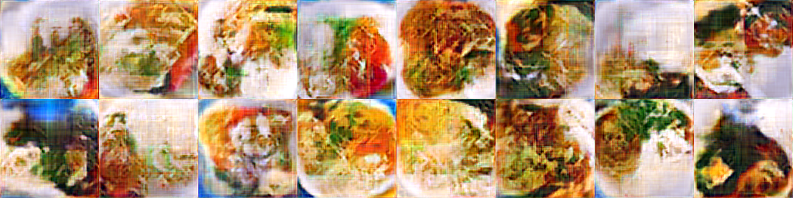

# FoodGAN: Generate Fake Foods.

## Model

The model in this repo is a simple DCGAN, you may find its definition [here](https://github.com/enhuiz/foodgan/blob/5cc9350342887c406476a45b9c94777eb4f90e04/scripts/models/dcgan.py#L5).


## Setup

```
pip install -r requirements.txt
```

## Run

```python
zouqi config/dcgan.yml train
```

## Example Runs

After 25k iterations of runs:



